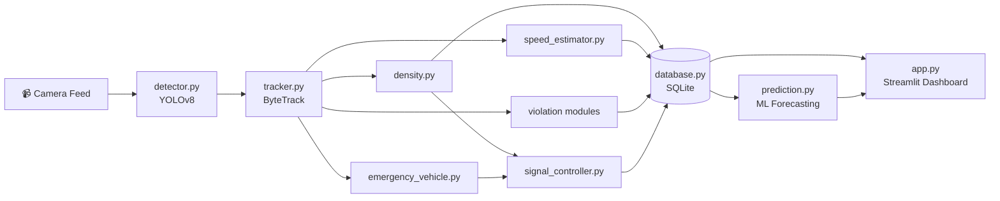

<div align="center">

# 🚦 AI-Based Intelligent Traffic Monitoring & Smart Traffic Signal Management System

### A Smart City AI application that monitors live traffic, dynamically controls signals, prioritizes emergency vehicles, detects violations, and forecasts congestion — powered by YOLOv8, ByteTrack, and Machine Learning.

[](https://www.python.org/)
[](https://streamlit.io/)
[](https://github.com/ultralytics/ultralytics)
[](LICENSE)
[]()

**[🔴 Live Demo](https://intelligent-traffic-monitoring-systemds-njdm4fnuegvbvpjxytphd7.streamlit.app/)** · **[📖 Documentation](#-module-reference)** · **[🐛 Report Bug](../../issues)** · **[✨ Request Feature](../../issues)**

</div>

---

## 🎯 About The Project

Traditional traffic signals run on **fixed timers**, ignoring real road conditions — causing congestion, delayed emergency response, and zero automated violation enforcement.

This project fixes that with an end-to-end AI pipeline:

- 🚗 **Real-time vehicle detection & tracking** — YOLOv8 + ByteTrack
- 🚦 **Adaptive signal timing** — based on live traffic density, not fixed schedules
- 🚑 **Emergency vehicle priority** — auto-overrides signal for ambulances/police/fire trucks
- ⚡ **Speed estimation & overspeed alerts**
- 📸 **Automated violation detection** — red-light jumping, wrong-lane driving, illegal parking
- 🔮 **ML-based traffic forecasting** — Random Forest / XGBoost / Linear Regression
- 📊 **Professional live dashboard** — built with Streamlit + Plotly

---

## 🔴 Live Demo

| Resource | Link |
|---|---|
| 🌐 **Live Dashboard** | [Click here to view →](https://intelligent-traffic-monitoring-systemds-njdm4fnuegvbvpjxytphd7.streamlit.app/) |
| 🎬 **Demo Video** | [Watch demo →](https://drive.google.com/file/d/1VUOGlHYSaIKIzUWbqSGxVWmNzUzzZh-M/view?usp=drive_link) |

---

## 🏗️ System Architecture



---

## 🧰 Tech Stack

<div align="center">

| Layer | Technologies |
|---|---|
| **Computer Vision** |    |
| **Backend** |    |
| **Machine Learning** |   |
| **Database** |  |
| **Dashboard** |   |

</div>

---

## 📂 Project Structure

```
intelligent-traffic-monitoring-system_DS/
│
├── app.py                    # 🖥️ Main Streamlit dashboard (7 pages)
├── detector.py                # 🎯 YOLOv8 detection wrapper
├── tracker.py                 # 🔗 ByteTrack multi-object tracking
├── density.py                 # 📊 Density classification + lane assignment
├── signal_controller.py       # 🚦 Adaptive signal timing logic
├── speed_estimator.py         # ⚡ Pixel-displacement speed estimation
├── emergency_vehicle.py       # 🚑 Emergency vehicle detection hook
├── database.py                 # 🗄️ SQLite schema + operations
├── config.py                   # ⚙️ Central configuration
├── utils.py                    # 🧩 Drawing / HUD helpers
├── requirements.txt
└── README.md
```

---

## 🚀 Getting Started

### Prerequisites
- Python 3.12+
- pip
- (Optional) GPU with CUDA for faster YOLOv8 inference

### 1. Clone the repository
```bash
git clone https://github.com/Rahim-Kamran/intelligent-traffic-monitoring-system_DS.git
cd intelligent-traffic-monitoring-system_DS
```

### 2. Create a virtual environment
```bash
python -m venv venv
source venv/bin/activate      # Windows: venv\Scripts\activate
```

### 3. Install dependencies
```bash
pip install -r requirements.txt
```

### 4. Run the dashboard
```bash
streamlit run app.py
```

The dashboard will open at `http://localhost:8501`.

---

## 🧩 Module Reference

| File | Responsibility |
|---|---|
| `detector.py` | Runs pretrained YOLOv8 COCO model to detect cars, trucks, buses, motorcycles, bicycles, pedestrians, traffic lights, and stop signs |
| `tracker.py` | Wraps ByteTrack to assign persistent IDs and maintain movement history per vehicle |
| `density.py` | Classifies traffic into **Low / Medium / High / Very High** and assigns vehicles to 3 virtual lanes |
| `signal_controller.py` | Calculates green-signal duration from density; supports emergency override |
| `speed_estimator.py` | Estimates km/h from pixel displacement; flags overspeeding |
| `emergency_vehicle.py` | Integration point for emergency vehicle classifier (ambulance/police/fire truck) |
| `database.py` | Manages SQLite schema and CRUD across vehicle/density/speed/signal tables |
| `utils.py` | Bounding box drawing and live HUD overlay utilities |
| `config.py` | Single source of truth for thresholds, mappings, and timing rules |

---

## 🗄️ Database Schema

| Table | Stores |
|---|---|
| `vehicle_events` | Track ID, vehicle type, lane, timestamp |
| `density_log` | Vehicle count + density level over time |
| `speed_log` | Per-vehicle speed readings and overspeed flags |
| `signal_log` | Signal duration decisions and triggering density level |

---

## 📊 Dashboard Pages

| Page | What it shows |
|---|---|
| 📊 **Dashboard** | Live KPI cards + Vehicle Distribution, Hourly Traffic, Density Trend, Lane-wise Count |
| 🎥 **Live Detection** | Live feed with bounding boxes/IDs, frame stats, detected-objects table |
| 📈 **Analytics** | Distribution, hourly pattern, density trend, speed vs. limit, lane comparison, weekly heatmap |
| 📄 **Reports** | Filterable violation log + CSV export |
| 🔮 **Prediction** | ML forecast, model selector, historical vs. predicted chart |
| ⚙️ **Settings** | Detection thresholds, signal rules, speed limit, alert preferences |
| ℹ️ **About** | Project summary + architecture diagram |

---

## ⚠️ Known Limitations

- Pretrained YOLOv8 COCO doesn't natively distinguish ambulances/police/fire trucks — `emergency_vehicle.py` needs a fine-tuned classifier for production use
- Speed accuracy depends on correct `PIXELS_PER_METER` calibration per camera
- Current signal logic is simplified for single-approach demo — full intersections need per-lane phase sequencing
- The live dashboard currently runs on simulated/dummy data; real YOLOv8 detection pipeline is wired separately in Colab

---

## 🛣️ Roadmap

- [ ] Wire live YOLOv8 detection into the deployed dashboard
- [ ] Multi-junction coordinated signal control
- [ ] Real CCTV/RTSP live stream integration
- [ ] Fine-tuned emergency vehicle classifier
- [ ] Mobile app for citizens & traffic police
- [ ] Edge deployment (Jetson/Raspberry Pi)

See [open issues](../../issues) for the full list of proposed features.

---

## 🤝 Contributing

Contributions make the open-source community amazing. Any contributions are **greatly appreciated**.

1. Fork the repo
2. Create your feature branch (`git checkout -b feature/AmazingFeature`)
3. Commit your changes (`git commit -m 'Add some AmazingFeature'`)
4. Push to the branch (`git push origin feature/AmazingFeature`)
5. Open a Pull Request

---

## 🙌 Acknowledgements

- [Ultralytics YOLOv8](https://github.com/ultralytics/ultralytics)
- [Supervision (ByteTrack)](https://github.com/roboflow/supervision)
- [Streamlit](https://streamlit.io/)
- Metro Interstate Traffic Volume Dataset — UCI Machine Learning Repository

---

<div align="center">

**⭐ Star this repo if you found it useful!**

Made with ❤️ for Smart Cities

</div>
